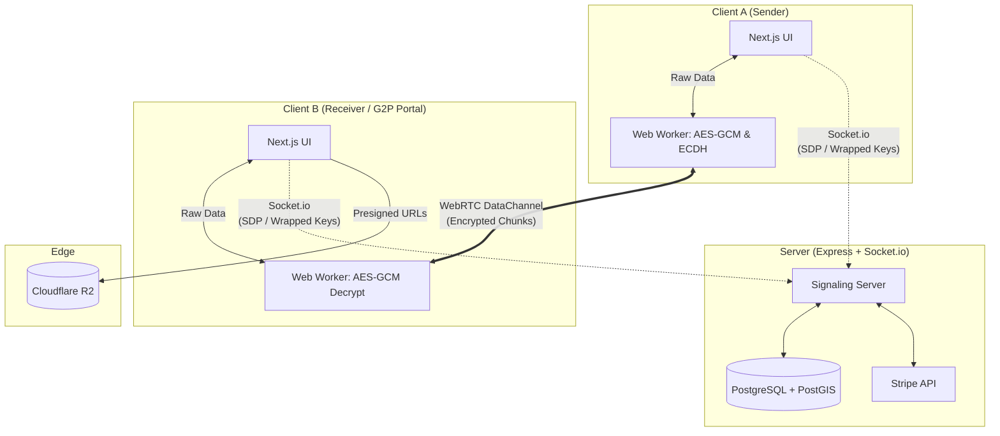

<div align="center">


# Share2Me

### Secure · Peer-to-Peer · Zero Cloud

**End-to-end encrypted file & text transfer powered by WebRTC and ECDH key exchange.**  
Your data travels directly between devices — it never touches a server.

<br />

[](https://www.typescriptlang.org/)
[](https://nextjs.org/)
[](https://tailwindcss.com/)
[](https://postgresql.org/)
[](https://webrtc.org/)

<br />

</div>

---

## ✦ What is Share2Me?

Share2Me is a **browser-native, serverless transfer tool** that operates in two primary modes:
1. **P2P Mode**: Instant, browser-to-browser encrypted transfers for files and text. No accounts, no cloud, no limits.
2. **G2P (Get-to-Peer) Portals**: A robust vendor/receiver dashboard allowing users to claim a permanent "Share Code" and receive files dynamically from clients.

---

## ⚡ Core Features

### 1. Zero-Knowledge P2P Transfers
- **File Transfer**: Drag & drop any file of any size. It transfers over a WebRTC DataChannel via chunking.
- **Text Transfer**: Securely share passwords, code snippets, or long documents with formatting fully preserved using UTF-8 `TextEncoder/TextDecoder`.
- **E2E Encryption**: Every transfer is encrypted via AES-GCM-256 running securely inside a Web Worker. Keys are generated locally via ECDH P-256 and are never sent over the network.

### 2. G2P Dashboard (Receive Portals)
- **Permanent Share Codes**: Users log in (via Google Auth) to claim an alphanumeric Share Code (e.g., `STY392`).
- **LoadLogic UI Framework**: Built entirely on a custom modern glass-morphism aesthetic. It uses dark-accented Bento-Box layouts, animated side rails, and dynamic file type gradients.
- **Real-Time Synchronisation**: Uses `Socket.io` to pipe new incoming files instantly to the dashboard. You hear a chime (880Hz Web Audio API) when a file arrives.

### 3. Print Shop Network (`/g2p/nearby`)
- **GeoSpatial Discovery**: Share2Me utilizes a **PostGIS** database to perform precise geospatial queries (`ST_DWithin`).
- **Leaflet Maps**: Integrated mobile-responsive maps with dynamic OpenStreetMap geocoding so users can find local print shops near them.
- **Vendor Tools**: Print shops can upload custom banner images to **Cloudflare R2**, set B&W / Color printing prices, and manage real-time queues.
- **Stripe Payments**: Integrated monetization and Pro-Plan capabilities for heavy-duty receivers.

---

## 🔒 Security Model

| Layer | Mechanism | Guarantee |
|---|---|---|
| **Encryption** | AES-GCM-256 | Every chunk is individually encrypted with a random IV. |
| **Key Exchange** | ECDH P-256 | The Sender wraps the AES key, Receiver unwraps it. |
| **Key Safety** | In-Memory | The raw AES key never touches the server and isn't embedded in QR codes. |
| **Transport** | WebRTC DataChannel | Direct P2P path. Data does not travel through a server relay. |
| **Signaling** | Socket.io | Only used for the OTC room join, key exchange, and SDP relay. |

> **Note**: The signaling server acts as a blind relay. It sees encrypted blobs and public keys only. It **cannot** decrypt your files or text.

---

## 🏗️ Architecture



---

## 🛠️ Tech Stack

### Frontend
- **Framework**: Next.js 15 (App Router)
- **UI & Styling**: React 18, Tailwind CSS, Framer Motion, Lucide React
- **Mapping**: Leaflet, Nominatim API
- **State & Crypto**: Web Crypto API (Web Workers), React Hooks

### Backend
- **Server**: Node.js, Express, Socket.io
- **Database**: PostgreSQL with PostGIS extension (hosted natively or via Supabase)
- **ORM / Queries**: Raw `pg` queries for advanced geospatial logic
- **Storage**: Cloudflare R2 (S3-compatible) for vendor assets
- **Payments**: Stripe Checkout

---

## 🚀 Quick Start — Local Development

### Prerequisites
- **Node.js** 18+
- **PostgreSQL** running locally with the `PostGIS` extension enabled.
- **Cloudflare R2** and **Stripe** API keys (Required for G2P/Billing functions).

### 1. Environment Setup

You need two `.env` files. 

**`backend/g2p/.env`**
```env
# Database
PG_HOST=localhost
PG_PORT=5432
PG_USER=postgres
PG_PASSWORD=yourpassword
PG_DB=shareit

# Stripe
STRIPE_SECRET_KEY=sk_test_...

# Cloudflare R2
R2_ACCESS_KEY_ID=...
R2_SECRET_ACCESS_KEY=...
R2_ENDPOINT=https://<account-id>.r2.cloudflarestorage.com
R2_BUCKET_NAME=share2me
R2_PUBLIC_URL=https://pub-xxxx.r2.dev
```

**`frontend/.env.local`**
```env
NEXT_PUBLIC_SIGNAL_URL=http://localhost:3000
NEXT_PUBLIC_STRIPE_PUBLISHABLE_KEY=pk_test_...
```

### 2. Install Dependencies
```bash
cd backend && npm install
cd ../frontend && npm install
```

### 3. Start Both Servers
For the best development experience, run these in two separate terminals.

**Terminal 1 — Backend (Port 3000):**
```bash
cd backend
npm run dev
```

**Terminal 2 — Frontend (Port 3001):**
```bash
cd frontend
npm run dev -- --port 3001
```

### 4. Visit the Application
Open your browser and navigate to:
```text
http://localhost:3001
```

---

<div align="center">
<sub>Built with WebRTC · AES-GCM-256 · PostGIS · No cloud limits. No compromise.</sub>
</div>