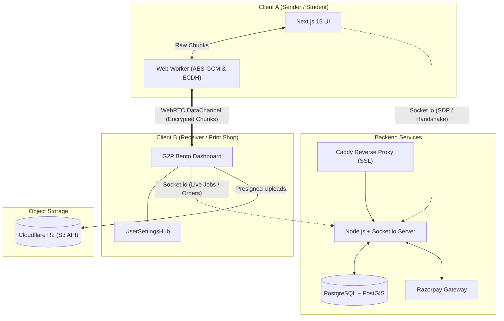

<div align="center">


# Share2Me (v3.5)

### Secure · Peer-to-Peer · Zero Cloud · Modern Merchant Hub

**End-to-end encrypted file & text transfer powered by WebRTC and ECDH key exchange.**  
Your data travels directly between devices — it never touches a server.

<br />

[](https://www.typescriptlang.org/)
[](https://nextjs.org/)
[](https://tailwindcss.com/)
[](https://postgresql.org/)
[](https://webrtc.org/)
[](https://developers.cloudflare.com/r2/)

<br />

</div>

---

## ✦ What is Share2Me?

Share2Me is a **browser-native, high-performance transfer and digital document platform** operating across two primary modes:

1. **Zero-Knowledge P2P Mode (`/`, `/p2p`)**: Instant, browser-to-browser encrypted transfers for files and clipboard text. No sign-ups, no cloud intermediaries, and zero arbitrary file size limits.
2. **G2P (Get-to-Peer) Receive & Merchant Hub (`/g2p`)**: A full-featured receiver dashboard allowing vendors, print shops, and educators to claim a permanent alphanumeric Share Code, receive student/client uploads in real-time, configure direct UPI settlements, and customize portal branding.
3. **Productivity Tools Suite (`/tools`)**: Built-in browser-side and edge-accelerated utilities including PDF signing, background removal, PDF page numbering, and visual editing.

---

## ⚡ Core Features (v3.5)

### 1. Zero-Knowledge P2P Transfers
- **Unlimited File Transfer**: Drag & drop files of any size. Chunks stream directly over a WebRTC `RTCDataChannel` with backpressure control and NACK packet resend.
- **Cross-Device Clipboard Sync**: Securely transmit passwords, formatted text, and code snippets preserved via UTF-8 `TextEncoder` / `TextDecoder`.
- **E2E Encryption**: AES-GCM-256 chunk encryption runs inside dedicated Web Workers (`public/worker.js`). Cryptographic keys are generated locally via ECDH P-256 and never touch the signaling server.

### 2. G2P Bento Dashboard & Merchant Hub
- **Bento Box Architecture**: Modern glass-morphism aesthetic (`backdrop-blur-2xl`, dynamic SVG gradients per file type, high-contrast surfaces).
- **Real-Time WebSocket Sync**: Real-time push updates via `socket.io-client` (`g2p:new_submission`, `g2p:file_downloaded`) accompanied by an optional 880Hz audio chime.
- **Interactive Micro-Interactions**: Built with `useTransition` for zero-lag tab switches, `ScrambleText` code reveals, `AnimatedCopyIcon`, `ConfettiButton`, and custom right-click context menu portals.

### 3. Decoupled User Settings & Onboarding Hub (`UserSettingsHub.tsx`)
- **Automated Vendor Onboarding**: First-time print shops are guided through an unskippable, animated glassmorphic wizard that configures their profile, pricing, and securely auto-connects the local hardware Print Agent via a local HTTP bridge (`localhost:13337`).
- **Fluid Responsive Pill Navigation**: Dynamic segmented bar (`Storefront` · `Pricing` · `Payouts` · `Plan & QR`) that smoothly scrolls on mobile with auto-centering and symmetrically expands on desktop without text clipping.
- **Storefront & Contact Profile**: Manage public vendor name, phone, organization, bio, pickup landmark, and live GPS coordinates pinned via OpenStreetMap Nominatim reverse geocoding.
- **Photo Gallery**: Upload up to 3 shopfront images to Cloudflare R2 using secure presigned URLs, with touch-friendly deletion controls.
- **Order Intake & Rate Catalog**: One-touch store status toggle (Accepting Orders vs. Paused) and per-page rates for B&W and Full Color printing.
- **Data Retention & Auto-Purge**: Configurable customer file auto-purge window (2 Hours default, up to 7 Days for Pro).
- **Direct UPI Settlement & 2FA**: 100% of customer payments route straight to vendor UPI accounts with zero platform fees, protected by 2-Factor Authentication email OTP verification.
- **Portal QR Branding**: Live SVG QR code generation (`react-qr-code`) with custom foreground, background colors, and center logo URL preview.
- **Contextual Floating Save Bar**: Elevated floating save bar (`bottom-24 lg:bottom-6`) with dirty-state change tracking that never collides with the mobile dock.

### 4. Print Shop Geo-Discovery (`/g2p/nearby`)
- **PostGIS Geospatial Engine**: High-performance spatial indexing using `ST_DWithin` to query nearby print vendors within a configurable radius.
- **Interactive Leaflet Maps**: Mobile-responsive vector map interface with live store status, pricing tags, and directions.

### 5. Pro Vendor Subscriptions & Monetization
- **Razorpay Integration**: In-app ₹499/30-day Pro tier unlocking 10 GB cloud storage, up to 7-day retention, 500 MB upload quotas, and 100% ad-free student upload interfaces.

---

## 🔒 Security Model

| Layer | Mechanism | Guarantee |
|---|---|---|
| **P2P Encryption** | AES-GCM-256 | Every chunk encrypted individually with a distinct random IV. |
| **Key Exchange** | ECDH P-256 | Ephemeral sender keypair wraps file key; receiver unwraps locally. |
| **Key Isolation** | In-Memory Only | Raw cryptographic keys never touch servers and are omitted from QR payloads. |
| **Transport** | WebRTC DataChannel | Direct peer-to-peer data path bypassing central relays. |
| **Signaling** | Socket.io | Acts as a blind relay passing encrypted handshakes and SDP envelopes. |
| **Vendor Banking** | 2FA Email OTP | Bank and UPI detail modifications require verified one-time passwords. |

---

## 🏗️ System Architecture


```mermaid
graph TD
    subgraph client_a ["Client A (Sender / Student)"]
        UI_A["Next.js 15 UI"]
        Worker_A["Web Worker (AES-GCM & ECDH)"]
        UI_A <-->|"Raw Chunks"| Worker_A
    end

    subgraph client_b ["Client B (Receiver / Print Shop)"]
        UI_B["G2P Bento Dashboard"]
        Settings_B["UserSettingsHub"]
        UI_B --- Settings_B
    end

    subgraph server_stack ["Backend Services"]
        Sig["Node.js + Socket.io Server"]
        Postgres[("PostgreSQL + PostGIS")]
        Razorpay["Razorpay Gateway"]
        Caddy["Caddy Reverse Proxy (SSL)"]
    end

    subgraph edge_storage ["Object Storage"]
        R2[("Cloudflare R2 (S3 API)")]
    end

    %% WebRTC P2P
    Worker_A <==>|"WebRTC DataChannel (Encrypted Chunks)"| UI_B

    %% Realtime Signaling & API
    UI_A -.->|"Socket.io (SDP / Handshake)"| Sig
    UI_B -.->|"Socket.io (Live Jobs / Orders)"| Sig
    Caddy --> Sig

    %% Database & Cloud Integrations
    Sig <--> Postgres
    Sig <--> Razorpay
    UI_B -->|"Presigned Uploads"| R2
```

---

## 🛠️ Tech Stack

### Frontend
- **Framework**: Next.js 15.5 (App Router, Turbopack compatible)
- **Language**: TypeScript 5.x
- **UI & Animations**: React 18/19, Tailwind CSS, Framer Motion, Lucide React, Canvas Confetti
- **QR & Media**: `react-qr-code`, `jsQR`
- **Mapping**: Leaflet, OpenStreetMap Nominatim
- **State & Crypto**: Web Crypto API (Web Workers), React Hooks

### Backend
- **Runtime**: Node.js, Express, Socket.io
- **Database**: PostgreSQL 15+ with PostGIS (`ST_DWithin`, spatial indexes)
- **Storage**: Cloudflare R2 (S3-compatible zero-egress bucket)
- **Billing**: Razorpay Subscriptions & UPI Intent
- **Reverse Proxy**: Caddy (automated Let's Encrypt TLS)

---

## ✦ Repository Layout

```
ShareIt/
├── backend/                         # Express + Socket.io signaling & API server
│   ├── server.js                    #   Entry point — WebSocket relay + API
│   ├── g2p/                         #   G2P vendor routes, billing, R2 presigning
│   ├── db/                          #   Postgres + PostGIS migration scripts
│   └── package.json
│
├── frontend/                        # Next.js 15 App Router web application
│   ├── src/
│   │   ├── app/
│   │   │   ├── layout.tsx           #   Root layout, fonts, SideRail, analytics
│   │   │   ├── page.tsx             #   Home page — transfer workspace
│   │   │   ├── g2p/                 #   G2P portal, dashboard, and nearby map
│   │   │   │   ├── page.tsx         #   Dashboard authenticated container
│   │   │   │   ├── [code]/page.tsx  #   Public customer file-drop page
│   │   │   │   └── nearby/page.tsx  #   PostGIS nearby print shops explorer
│   │   │   ├── tools/               #   Productivity suite (PDF signer, editor, bg remover)
│   │   │   └── pricing/             #   Share2Me Pro tier plans & billing
│   │   ├── components/
│   │   │   ├── G2pDashboard.tsx     #   Bento Box vendor dashboard
│   │   │   ├── SideRail.tsx         #   Fluid mobile curved dock & desktop rail
│   │   │   ├── settings/            #   Modular Settings Sub-Architecture
│   │   │   │   └── UserSettingsHub.tsx  # Storefront, Rates, UPI 2FA, QR Branding
│   │   │   ├── SendFlow.tsx         #   P2P file & text sender
│   │   │   ├── ReceiveFlow.tsx      #   P2P file & text receiver
│   │   │   └── ui/                  #   AnimatedCopyIcon, ScrambleText, ConfettiButton
│   │   ├── hooks/
│   │   │   ├── useSocket.ts         #   Socket.io singleton hook
│   │   │   └── useTransfer.ts       #   P2P state machine
│   │   └── lib/
│   │       ├── printShop.ts         #   Vendor API client & TypeScript interfaces
│   │       └── backendUrl.ts        #   Dynamic backend resolution
│   ├── public/
│   │   ├── worker.js                #   Crypto worker (AES-GCM + ECDH)
│   │   └── storage.js               #   OPFS / IndexedDB persistence
│   ├── tailwind.config.ts           #   Design system tokens
│   └── next.config.mjs              #   Security headers, CSP, image domains
│
├── knowledge/                       # Architecture decisions & developer guides
│   ├── knowledge-base.md            #   Comprehensive developer onboarding guide
│   ├── DESIGN.md                    #   UI design system standards
│   └── security_audit_plan.md       #   Security audit & remediation records
│
├── docker-compose.yml               # Production container stack
└── README.md                        # Project root documentation
```

---

## ✦ Quick Start — Local Development

### Prerequisites
- **Node.js** 18+ or 20+
- **PostgreSQL** running locally with `postgis` extension:
  ```sql
  CREATE EXTENSION IF NOT EXISTS postgis;
  ```
- **Cloudflare R2** bucket and **Razorpay** test credentials (for G2P features).

### 1. Configure Environment Files

**`backend/g2p/.env`**
```env
PORT=3000
PG_HOST=localhost
PG_PORT=5432
PG_USER=postgres
PG_PASSWORD=your_password
PG_DB=shareit

# Cloudflare R2
R2_ACCESS_KEY_ID=your_key
R2_SECRET_ACCESS_KEY=your_secret
R2_ENDPOINT=https://<account_id>.r2.cloudflarestorage.com
R2_BUCKET_NAME=share2me
R2_PUBLIC_URL=https://pub-xxxx.r2.dev

# Razorpay
RAZORPAY_KEY_ID=rzp_test_...
RAZORPAY_KEY_SECRET=...
```

**`frontend/.env.local`**
```env
NEXT_PUBLIC_SIGNAL_URL=http://localhost:3000
NEXT_PUBLIC_API_BASE=http://localhost:3000/g2p/printshop
NEXT_PUBLIC_RAZORPAY_KEY_ID=rzp_test_...
```

### 2. Install Dependencies
```bash
npm run install:all
```

### 3. Start Development Servers
```bash
# Starts backend (port 3000) and frontend (port 3001) simultaneously:
npm run dev
```

### 4. Access the Application
- **Main Transfer & Tools**: [http://localhost:3001](http://localhost:3001)
- **G2P Merchant Dashboard**: [http://localhost:3001/g2p](http://localhost:3001/g2p)
- **Nearby Print Shops Map**: [http://localhost:3001/g2p/nearby](http://localhost:3001/g2p/nearby)

---

## ✦ Application Routes

| Route | Functionality |
|---|---|
| `/` | Main P2P workspace (instant file & clipboard text sharing) |
| `/g2p` | G2P Bento Vendor Dashboard & User Settings Hub |
| `/g2p/[code]` | Client file-drop portal for a specific Share Code |
| `/g2p/nearby` | Geospatial print shop finder with Leaflet & PostGIS |
| `/tools` | Client-side productivity suite (Sign PDF, BG Remover, Editor) |
| `/pricing` | Share2Me Pro subscription upgrade portal |
| `/about`, `/terms`, `/privacy` | Information, terms, and compliance |

---

## ✦ License

MIT © 2026 Share2Me Technologies. Built with WebRTC, AES-GCM-256, Next.js 15, and PostGIS.