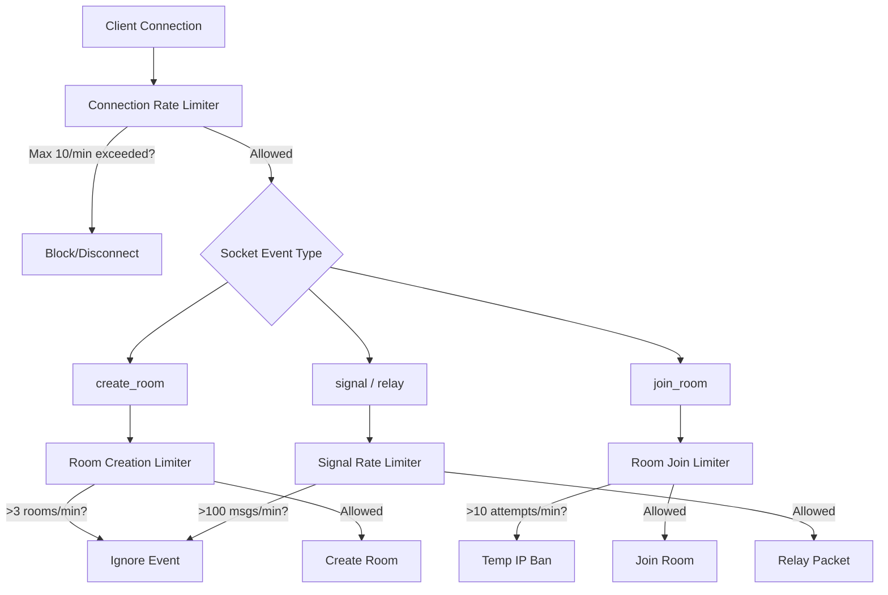

# Security Audit & Rate Limiting Plan for ShareIt Backend

This plan outlines existing security vulnerabilities in the current signaling server and details a lightweight, free-tier-friendly implementation plan to protect the backend from DoS attacks, brute-force room guessing, and memory leaks.

---

## 1. Security Vulnerability Analysis

A review of `backend/server.js` reveals the following security risks:

### A. Memory Leak: Unbounded `otcAttempts` Map
* **Vulnerability**: In `join_room`, brute-force attempts are stored in the global `otcAttempts` Map:
  ```javascript
  const count = otcAttempts.get(key) || 0;
  otcAttempts.set(key, count + 1);
  ```
* **Impact**: This Map is **never cleared**. Over time, as distinct IPs connect, this Map will grow boundlessly, eventually exhausting the server's RAM (OOM crash).
* **Severity**: **High** (Guaranteed crash over time).

### B. Unbounded Room Creation (DoS)
* **Vulnerability**: Legitimate or malicious clients can call `create_room` repeatedly. Each call generates a new room and inserts it into `otcToRoom`.
* **Impact**: A simple loop emitting `create_room` can generate millions of rooms in memory. Although a socket's disconnect cleans up the *last* room it was associated with (`socket.roomOTC`), the socket can create thousands of rooms before disconnecting, or can simply stay connected while spawning rooms.
* **Severity**: **High** (Trivial to exploit and crash the server).

### C. Brute-Force Room Guessing (6-Digit OTC)
* **Vulnerability**: OTCs are only 6 digits (1,000,000 combinations). With no timed reset on `otcAttempts`, an attacker can distribute guesses across multiple socket connections or IPs over time.
* **Impact**: Attackers can hijack file transfers by intercepting active rooms.
* **Severity**: **Medium** (Mitigated by WebRTC end-to-end encryption, but leaks metadata and connection details).

### D. Lacking Message Payload/Size Limits
* **Vulnerability**: The server relays message payloads (`signal`, `wrapped_key`, `key_exchange`) directly without verifying size:
  ```javascript
  socket.on('signal', (msg) => {
    socket.to(msg.otc).emit('signal', msg);
  });
  ```
* **Impact**: A client can send massive packets (megabytes of garbage data), consuming 100% of the CPU/bandwidth of the single free-tier EC2 instance and crashing the signaling channel.
* **Severity**: **Medium**.

---

## 2. Mitigation & Rate Limiting Plan

To keep hosting completely free (running on `t3.micro` without needing a paid Redis/database instance), we will implement a high-performance, in-memory rate limiter that uses automatic TTL (Time-To-Live) eviction to prevent memory leaks.



### A. In-Memory Sliding Window Rate Limiter
We will write a lightweight `RateLimiter` class in `server.js` that tracks requests in memory and automatically evicts expired records.

```javascript
class RateLimiter {
  constructor(windowMs, maxRequests) {
    this.windowMs = windowMs;
    this.maxRequests = maxRequests;
    this.requests = new Map(); // key -> Array of timestamps
  }

  isRateLimited(key) {
    const now = Date.now();
    let timestamps = this.requests.get(key) || [];
    
    // Filter out timestamps outside the sliding window
    timestamps = timestamps.filter(ts => now - ts < this.windowMs);
    
    if (timestamps.length >= this.maxRequests) {
      this.requests.set(key, timestamps); // update cleaned list
      return true;
    }
    
    timestamps.push(now);
    this.requests.set(key, timestamps);
    return false;
  }
  
  // Cleanup method run periodically to prevent memory leaks
  prune() {
    const now = Date.now();
    for (const [key, timestamps] of this.requests.entries()) {
      const active = timestamps.filter(ts => now - ts < this.windowMs);
      if (active.length === 0) {
        this.requests.delete(key);
      } else {
        this.requests.set(key, active);
      }
    }
  }
}
```

### B. Specific Limit Thresholds
We will instantiate separate rate limiters for different actions:

| Action | Limit Threshold | Scope | Violation Action |
|---|---|---|---|
| **New Socket Connection** | 10 connections / 1 minute | IP Address | Refuse connection |
| **`create_room`** | 3 rooms / 1 minute | IP Address | Ignore event & return error |
| **`join_room`** (Brute-force protection) | 10 attempts / 1 minute | IP Address | Block IP from joining for 5 minutes |
| **Signaling/Relay** | 120 messages / 1 minute | Socket ID | Disconnect socket |

### C. Active Room Garbage Collection
To prevent orphaned rooms from occupying memory, we will add a background janitor loop that runs every 5 minutes:
* Any room older than 30 minutes will be deleted from `otcToRoom`.
* Any room with 0 connected sockets will be deleted immediately.

### D. Payload Size Enforcement
Before forwarding any payload on `signal`, `key_exchange`, or `wrapped_key`, we will verify the stringified size of the payload. If it exceeds **100 KB** (plenty of size for WebRTC SDP / ICE candidate exchange), we discard it and disconnect the offending socket.

---

## 3. Implementation Steps

If you approve this plan, I will perform the following steps:
1. Update `backend/server.js` to implement the `RateLimiter` class, payload verification, and garbage collection.
2. Verify locally that the backend runs and passes all build checks.
3. Push changes to GitHub and securely deploy them to your AWS EC2 instance.
4. Run testing commands using multiple connections to verify rate limiting and payload enforcement works.
