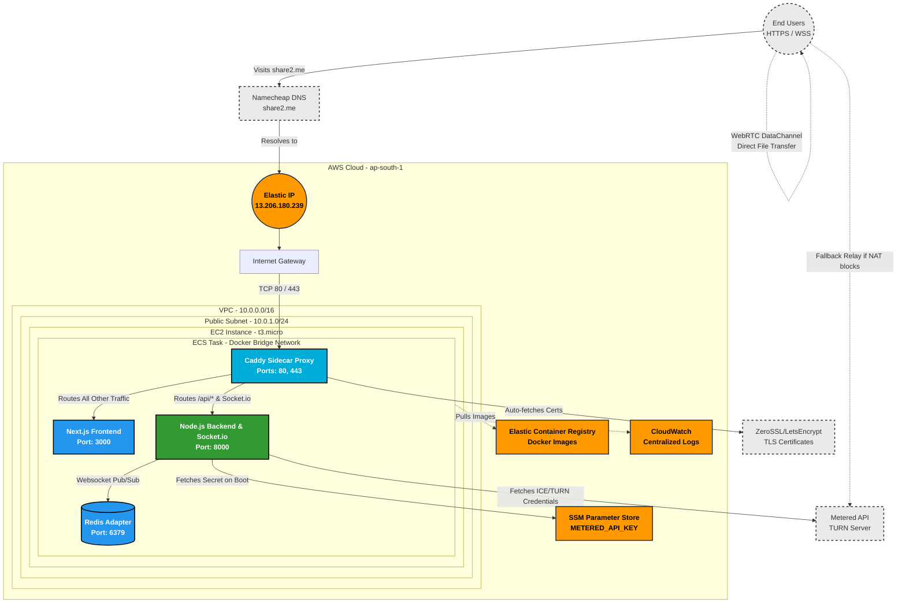

# Share2Me v2.9 Infrastructure Flow Diagram

This document contains the complete infrastructure architecture and data flow for Share2Me (version 2.9) on AWS.

```mermaid
graph TD
    %% Define Styles
    classDef aws fill:#FF9900,stroke:#232F3E,stroke-width:2px,color:black,font-weight:bold;
    classDef container fill:#2496ED,stroke:#000000,stroke-width:2px,color:white,font-weight:bold;
    classDef caddy fill:#00ADD8,stroke:#000000,stroke-width:2px,color:white,font-weight:bold;
    classDef nodejs fill:#339933,stroke:#000000,stroke-width:2px,color:white,font-weight:bold;
    classDef external fill:#EAEAEA,stroke:#333333,stroke-width:2px,stroke-dasharray: 5 5;

    %% External Entities
    User((End Users<br/>HTTPS / WSS)):::external
    DNS[Namecheap DNS<br/>share2.me]:::external
    ZeroSSL[ZeroSSL/LetsEncrypt<br/>TLS Certificates]:::external
    Metered[Metered API<br/>TURN Server]:::external

    %% AWS Infrastructure Boundary
    subgraph AWS[AWS Cloud - ap-south-1]
        IGW[Internet Gateway]
        EIP((Elastic IP<br/>13.206.180.239)):::aws
        SSM[SSM Parameter Store<br/>METERED_API_KEY]:::aws
        ECR[Elastic Container Registry<br/>Docker Images]:::aws
        CW[CloudWatch<br/>Centralized Logs]:::aws

        subgraph VPC[VPC - 10.0.0.0/16]
            subgraph Subnet[Public Subnet - 10.0.1.0/24]
                subgraph EC2[EC2 Instance - t3.micro]
                    subgraph ECS[ECS Task - Docker Bridge Network]
                        Caddy[Caddy Sidecar Proxy<br/>Ports: 80, 443]:::caddy
                        Frontend[Next.js Frontend<br/>Port: 3000]:::container
                        Backend[Node.js Backend & Socket.io<br/>Port: 8000]:::nodejs
                        Redis[(Redis Adapter<br/>Port: 6379)]:::container
                    end
                end
            end
        end
    end

    %% Traffic Flow
    User -->|Visits share2.me| DNS
    DNS -->|Resolves to| EIP
    EIP --> IGW
    IGW -->|TCP 80 / 443| Caddy

    %% Caddy Routing Logic
    Caddy -->|Auto-fetches Certs| ZeroSSL
    Caddy -->|Routes /api/* & Socket.io| Backend
    Caddy -->|Routes All Other Traffic| Frontend

    %% Backend Dependencies
    Backend -->|Websocket Pub/Sub| Redis
    Backend -->|Fetches Secret on Boot| SSM
    Backend -->|Fetches ICE/TURN Credentials| Metered

    %% WebRTC Peer-to-Peer
    User -.->|WebRTC DataChannel<br/>Direct File Transfer| User
    User -.->|Fallback Relay if NAT blocks| Metered

    %% Infrastructure Dependencies
    ECS -.->|Pulls Images| ECR
    ECS -.->|Pushes Container Logs| CW
```
