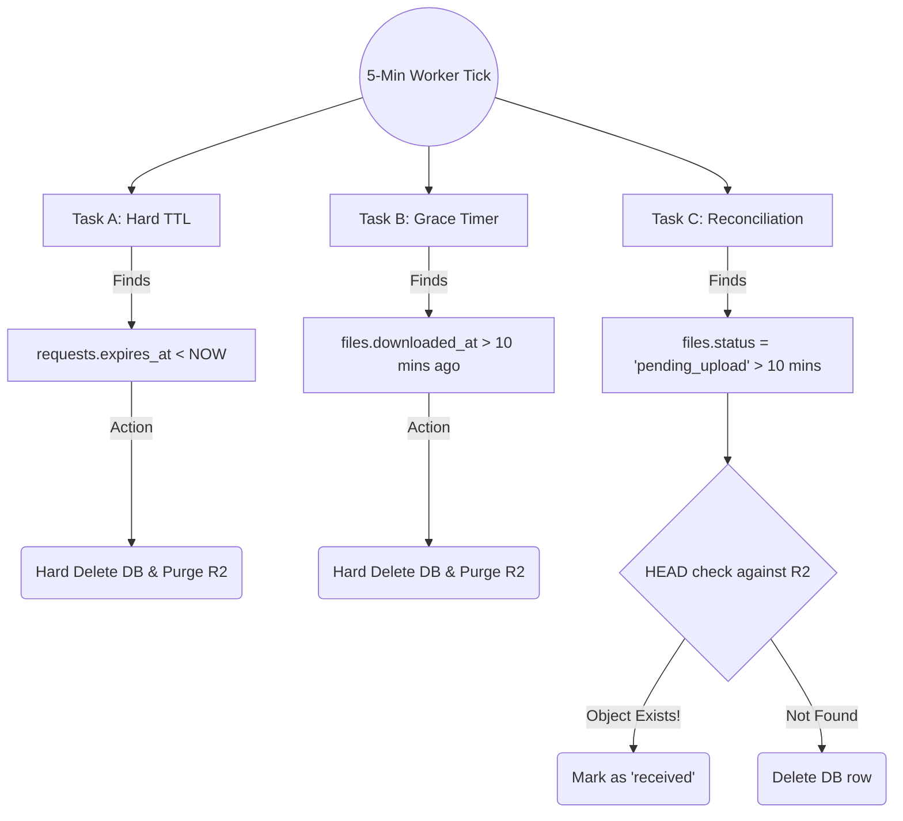

# G2P System Architecture & Flow

This document visualizes the complete end-to-end flow of the G2P (Group-to-Person) Print Queue system, demonstrating how the isolated microservice architecture handles submissions safely and updates the vendor in real-time.

### 1. Authentication Model (NextAuth + Jose)

Since the frontend (Next.js) and the backend (Express) run as completely separate containers/processes, they need a secure way to trust each other without a shared session store. 

We are using a **Stateless Shared-Secret JWT Auth Model**:
1. **Frontend (`NextAuth.js`)**: Handles the Google OAuth login. When a vendor logs in, NextAuth signs a JSON Web Token (JWT) using a secret (`AUTH_SECRET`).
2. **Backend (`jose` library)**: When the vendor makes an API request or connects to Sockets, they send that JWT. The Express backend uses `jose` to independently verify the token using the exact same secret (`AUTH_JWT_SECRET`). 

If the signature matches, the backend knows the user is authenticated and who they are—all without making an extra database trip.

---

### 2. The G2P Architecture & Upload Flow

This diagram illustrates the "Direct-to-S3" upload pattern. Notice how the file data **never** touches the Express API, saving your server from massive bandwidth costs.

```mermaid
sequenceDiagram
    autonumber
    actor Student
    participant Frontend as Next.js UI
    participant API as Express API (Backend)
    participant DB as Supabase (PostgreSQL)
    participant R2 as Cloudflare R2
    participant Vendor as Vendor Dashboard (Sockets)

    rect rgb(20, 30, 40)
    note right of Student: 1. Safe Transactional Submission (Student)
    Student->>Frontend: Selects vendor & files
    Frontend->>API: POST /g2p/requests (Vendor ID)
    API->>DB: SELECT FOR UPDATE (Lock Vendor Row)
    DB-->>API: OK (Lock acquired, queue isn't full)
    API->>DB: INSERT new request
    API-->>Frontend: return requestId & statusToken
    
    loop Each File (Direct Upload Pattern)
        Frontend->>API: POST /g2p/files/presign
        API->>DB: Cap Checks & INSERT pending_upload
        API-->>Frontend: return R2 Presigned PUT URL
        Frontend->>R2: PUT /g2p/... (Direct Upload)
        note right of Frontend: Large file bytes bypass the Express API completely!
        R2-->>Frontend: 200 OK
        
        Frontend->>API: POST /g2p/files/:id/complete
        API->>R2: HEAD request (Verify existence & size)
        R2-->>API: 200 OK
        API->>DB: UPDATE status = 'received'
    end
    API-->>Vendor: Sockets: emit 'g2p:new_submission'
    end
    
    rect rgb(20, 40, 20)
    note right of Vendor: 2. Print Workflow (Vendor)
    Vendor->>API: POST /g2p/files/:id/download (Auth JWT)
    API->>DB: Verify Ownership & mark 'downloaded' (Starts 10m grace timer)
    API-->>Vendor: return R2 Presigned GET URL
    Vendor->>R2: Download File for Printing
    
    Vendor->>API: DELETE /g2p/requests/:id
    API->>DB: Hard Delete Request & Files
    API->>R2: Delete Objects
    API-->>Vendor: Sockets: emit 'g2p:request_removed' (clears UI instantly)
    end
```

---

### 3. The Automated Garbage Collector (Background Worker)

To ensure your storage costs never leak and the queue stays clean, the backend runs a silent worker every 5 minutes that sweeps the database.

