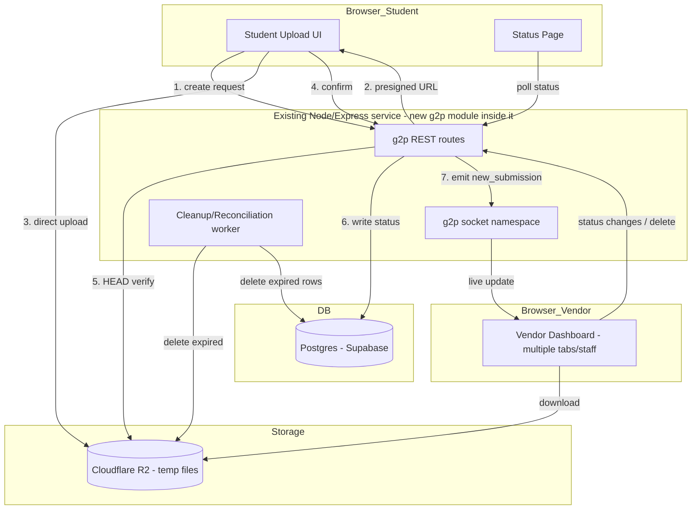
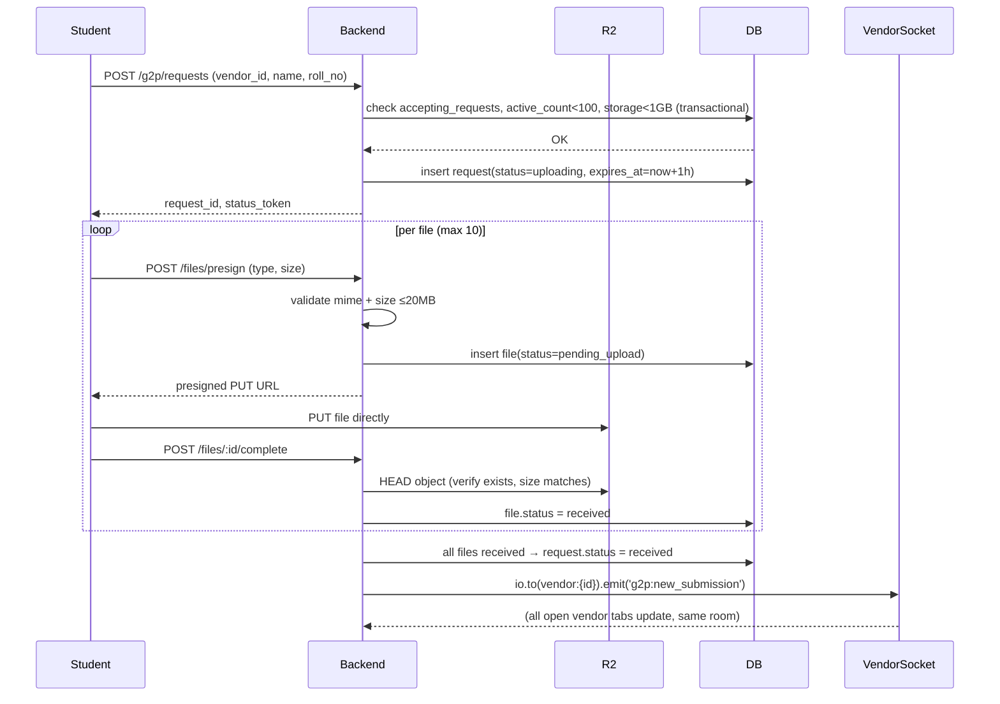

# Share2Me G2P — Master Build Plan (Final, Merged)

This is the single source of truth for building G2P, merging the architecture analysis, tool selection, flow design, codebase-accurate implementation details, full schema, and a phased execution plan.

---

## 1. What We're Building

G2P is an async, queue-based print-request system layered on top of Share2Me. Unlike P2P (live, peer-to-peer, zero server storage — both sides must be online at once), G2P is fundamentally different: **vendor gets a permanent identity → students submit files without an account → files sit in temporary cloud storage for up to 1 hour → vendor manages a live queue → files are wiped automatically once downloaded/printed, deleted manually, or expire.**

It shares only the frontend shell, Socket.io infrastructure, and branding with P2P. Storage, database, and real auth are entirely new additions — the current G2P code is a localStorage mock and is being replaced, not extended.

**Architectural call:** This is a **modular monolith**, not separate distributed microservices. G2P lives as an isolated module inside the existing backend deployment (own routes, own socket namespace, own DB tables, own env vars) — cheap to run, and the clean boundary means it *can* be split into a real separate service later if load ever demands it. Standing up real microservices now would add cost and complexity for zero benefit at pilot scale.

---

## 2. End-to-End Flow

### 2a. Vendor Side
```
1. Vendor registers (Auth.js / Google) → gets permanent Share2Me ID + QR code
2. Vendor opens dashboard → sees "Accepting Requests: OFF" by default
3. Vendor flips toggle ON
      → backend sets vendors.accepting_requests = true
      → broadcast to vendor's socket room (all open staff sessions update)
4. Students start appearing in the live queue as they submit
5. Vendor clicks a queue item → sees:
      - Name / identifier
      - Files (with color/B&W tag + optional message)
      - Copies per file
      - Submission time / time remaining before auto-delete
6. Vendor downloads file(s) → status moves to "Printing"
      → file is now flagged for deletion (grace-period, see §7)
7. Vendor marks "Ready for Pickup" → calls out the name
8. Vendor marks "Completed" or deletes manually
9. Vendor flips toggle OFF when done for the day
      → new submissions blocked immediately at the backend, not just UI
```

### 2b. Student / Customer Side (no account)
```
1. Scan vendor QR or enter Share2Me ID
2. If vendor is OFFLINE → page shows "Not accepting submissions right now" and blocks upload
3. If ONLINE → add up to 10 files (PDF/PNG/DOCX, 20MB each)
4. For each file: set copies (default 1), B&W or Color
5. Optional message field (e.g. "staple these two together")
6. Enter name + identifier (roll number or anything — no verification, general-purpose tool not student-only)
7. Submit → files upload directly to storage (not through the backend)
8. On success, student is shown a status link: share2.me/g2p/status/{random-token}
   → this works with zero login, and is the only way to check status
9. Student can revisit that link until the file expires or is completed
```

---

## 3. High-Level Architecture



---

## 4. Data Flow (Detailed Sequence)



---

## 5. Service Design (Module Boundaries)

```
backend/
  server.js                 → P2P only, untouched
  g2p/
    routes/
      requests.ts             → create request, list, get by id/token
      files.ts                 → presign, complete, download-redirect
      vendor.ts                 → toggle online/offline, profile
    socket/
      namespace.ts               → g2p:* events, room-per-vendor
    workers/
      cleanup.ts                  → runs every 5 min: TTL purge + reconciliation
    lib/
      storage.ts                   → thin R2 client wrapper (presign, head, delete)
      db.ts                         → Postgres/Prisma client
      validate.ts                    → mime/size allow-list + magic-byte check
    health.ts                        → /g2p/health, /g2p/metrics
```

This mirrors the "extract into its own module" pattern already recommended in the existing architecture notes, keeping P2P's stability completely unaffected by G2P bugs.

---

## 6. Exact Reuse Patterns From the Current Codebase

### 6a. Socket layer
Your `server.js` already has a connection middleware and room-join pattern — reuse it as-is, don't invent a new one.

**Connection middleware (unchanged, already covers G2P too):**
```js
io.use((socket, next) => {
  const ip = socket.handshake.address || 'unknown';
  const banUntil = bannedIPs.get(ip);
  if (banUntil && Date.now() < banUntil) return next(new Error('banned'));
  if (connLimiter.isRateLimited(ip)) {
    metrics.rateLimitHits++;
    return next(new Error('rate_limited'));
  }
  next();
});
```

**G2P room pattern — same shape as `create_room`/`join_room`, keyed by vendor instead of OTC:**
```js
socket.on('g2p:join_vendor_room', ({ vendorId, authToken } = {}, cb) => {
  const vendor = verifyVendorJWT(authToken); // see §6c
  if (!vendor || vendor.id !== vendorId) return cb?.({ error: 'unauthorized' });
  socket.join(`vendor:${vendorId}`);
  socket.vendorId = vendorId;
  cb?.({ ok: true });
});

io.to(`vendor:${vendorId}`).emit('g2p:new_submission', requestSummary);
io.to(`vendor:${vendorId}`).emit('g2p:status_update', { requestId, status });
io.to(`vendor:${vendorId}`).emit('g2p:request_removed', { requestId });
io.to(`vendor:${vendorId}`).emit('g2p:vendor_toggle', { accepting: bool });
```

**Why concurrent staff sessions are basically free to solve:** every staff member's dashboard tab joins the same `vendor:{vendorId}` room, so one broadcast reaches all of them simultaneously — no extra sync logic needed. DB remains the single source of truth; sockets are just the delivery mechanism for state that's already committed.

Students never join a socket room — they're anonymous and use polling instead (§6b, §12), so no auth burden is added to the anonymous side.

### 6b. Rate limiting
Your `RateLimiter` class is already generic and reusable. G2P just needs its own instances, same as `createRoomLimiter`/`joinRoomLimiter`/`signalLimiter`:

```js
const vendorJoinLimiter     = new RateLimiter(60_000, 30);  // 30 joins/min per IP
const requestCreateLimiter  = new RateLimiter(60_000, 10);  // 10 new requests/min per IP
const presignLimiter        = new RateLimiter(60_000, 40);  // 40 presign calls/min per IP (covers a 10-file batch + retries)
const statusPollLimiter     = new RateLimiter(10_000, 3);   // 3 polls / 10s per IP
```
Gate new HTTP routes and socket events with these using the same `isRateLimited(ip)` check already used for `connLimiter`. Reuse `bannedIPs` as-is for abuse escalation (e.g., auto-ban an IP that repeatedly hits `requestCreateLimiter`).

### 6c. Auth token verification
Auth.js runs in the Next.js frontend, but the socket/API layer is a **separate Express process** — it must independently verify the JWT Auth.js issues (shared secret), on both REST calls and the `g2p:join_vendor_room` socket event. This is why `jose` (or `jsonwebtoken`) is a required new backend dependency (§8).

---

## 7. Deployment Decision (Confirmed)

**G2P stays inside the existing ECS service and task definition — no new `aws_ecs_service` block.**

Reasons, based on the actual `ecs.tf`:
- The current task already bundles frontend + backend + redis + caddy behind one service.
- G2P's REST routes and socket namespace live inside the same backend container, same port, same process.
- None of the "spin up a separate service" triggers apply yet: no different scaling profile, no different port, no independent deploy cadence needed at pilot scale.

What *does* change in Terraform:
- New env vars/secrets on the existing task definition: `R2_ACCOUNT_ID`, `R2_ACCESS_KEY_ID`, `R2_SECRET_ACCESS_KEY`, `R2_BUCKET_NAME`, `DATABASE_URL`, `AUTH_JWT_SECRET`.
- These go through SSM Parameter Store, same as `METERED_API_KEY` already does — never plaintext in `docker-compose.yml` or Terraform source.

Revisit a separate ECS service only if G2P traffic genuinely needs independent scaling from the signaling server later.

---

## 8. Tools & New Dependencies

| Layer | Tool | Cost | Status |
|---|---|---|---|
| Object storage | Cloudflare R2 | Free tier covers MVP; ~$0.015/GB beyond | New |
| Database | Postgres via Supabase | Free tier | New |
| Vendor auth | Auth.js (NextAuth) + Google | Free | Replaces existing mock OAuth |
| Realtime | Existing Socket.io + Redis adapter, new `g2p` namespace | Free (already running) | Reused |
| Uploads | Presigned URL direct-to-R2 | Free (part of R2) | New pattern |
| Validation | Server-side mime allow-list + `file-type` magic-byte check | Free | New |
| Cleanup | `setInterval` worker (same pattern as existing P2P room cleanup) + R2 lifecycle backstop | Free | Reused pattern |

**Net-new npm packages (confirmed against current `package.json`, which only has `express`, `socket.io`, `redis`, `@socket.io/redis-adapter`, `http-proxy-middleware`):**

| Package | Purpose |
|---|---|
| `@aws-sdk/client-s3` | R2 is S3-compatible; standard AWS S3 SDK works against R2's S3 endpoint |
| `@aws-sdk/s3-request-presigner` | Generates presigned PUT URLs for direct browser→R2 upload |
| `prisma` / `@prisma/client` (or `pg` alone) | Postgres client + schema migrations/type safety |
| `jose` (or `jsonwebtoken`) | Backend verification of the Auth.js-issued JWT (§6c) |
| `file-type` | Magic-byte validation on upload confirmation |

**Total added monthly infra cost at pilot scale: effectively $0.**

---

## 9. Full Database Schema

```sql
-- Enums
CREATE TYPE request_status AS ENUM (
  'uploading', 'received', 'queued', 'printing', 'ready', 'completed', 'expired'
);
CREATE TYPE file_status AS ENUM (
  'pending_upload', 'received', 'downloaded', 'deleted', 'failed'
);
CREATE TYPE print_mode AS ENUM ('bw', 'color');

-- Vendors
CREATE TABLE vendors (
  id                  UUID PRIMARY KEY DEFAULT gen_random_uuid(),
  share2me_id         TEXT UNIQUE NOT NULL,          -- e.g. share2me@ansh434
  name                TEXT NOT NULL,
  email               TEXT UNIQUE NOT NULL,
  google_id           TEXT UNIQUE,
  accepting_requests  BOOLEAN NOT NULL DEFAULT false,
  qr_code_url         TEXT,
  created_at          TIMESTAMPTZ NOT NULL DEFAULT now(),
  updated_at          TIMESTAMPTZ NOT NULL DEFAULT now()
);
CREATE UNIQUE INDEX idx_vendors_share2me_id ON vendors(share2me_id);
CREATE UNIQUE INDEX idx_vendors_email ON vendors(email);

-- Requests
CREATE TABLE requests (
  id            UUID PRIMARY KEY DEFAULT gen_random_uuid(),
  status_token  UUID UNIQUE NOT NULL DEFAULT gen_random_uuid(),  -- public status-page token (unguessable)
  vendor_id     UUID NOT NULL REFERENCES vendors(id) ON DELETE CASCADE,
  student_name  TEXT NOT NULL,
  identifier    TEXT,                     -- roll number or any label, unverified
  message       TEXT CHECK (char_length(message) <= 200),
  status        request_status NOT NULL DEFAULT 'uploading',
  submitted_at  TIMESTAMPTZ NOT NULL DEFAULT now(),
  expires_at    TIMESTAMPTZ NOT NULL,      -- server-set: submitted_at + interval '1 hour'
  completed_at  TIMESTAMPTZ,
  deleted_at    TIMESTAMPTZ
);
CREATE INDEX idx_requests_vendor_status ON requests(vendor_id, status) WHERE deleted_at IS NULL;
CREATE INDEX idx_requests_expires_at ON requests(expires_at) WHERE deleted_at IS NULL;
CREATE UNIQUE INDEX idx_requests_status_token ON requests(status_token);

-- Files
CREATE TABLE files (
  id             UUID PRIMARY KEY DEFAULT gen_random_uuid(),
  request_id     UUID NOT NULL REFERENCES requests(id) ON DELETE CASCADE,
  storage_key    TEXT NOT NULL,            -- R2 object key
  filename       TEXT NOT NULL,
  mime_type      TEXT NOT NULL CHECK (mime_type IN (
                    'application/pdf',
                    'image/png',
                    'application/vnd.openxmlformats-officedocument.wordprocessingml.document'
                  )),
  size_bytes     BIGINT NOT NULL CHECK (size_bytes > 0 AND size_bytes <= 20 * 1024 * 1024),
  copies         INTEGER NOT NULL DEFAULT 1 CHECK (copies BETWEEN 1 AND 50),
  print_mode     print_mode NOT NULL DEFAULT 'bw',
  status         file_status NOT NULL DEFAULT 'pending_upload',
  downloaded_at  TIMESTAMPTZ,
  created_at     TIMESTAMPTZ NOT NULL DEFAULT now()
);
CREATE INDEX idx_files_request_id ON files(request_id);
CREATE INDEX idx_files_status_pending ON files(status) WHERE status = 'pending_upload';
```

**Aggregate caps enforced in application code, inside a single DB transaction with the insert (not as DB constraints, since they require `COUNT`/`SUM`):**
```sql
-- 100 active requests / vendor
SELECT COUNT(*) FROM requests
WHERE vendor_id = $1 AND status NOT IN ('completed', 'expired') AND deleted_at IS NULL;

-- 1GB active storage / vendor, checked before each presigned URL
SELECT COALESCE(SUM(f.size_bytes), 0) FROM files f
JOIN requests r ON r.id = f.request_id
WHERE r.vendor_id = $1 AND r.deleted_at IS NULL AND f.status != 'deleted';

-- 10 files / request, checked before each presigned URL
SELECT COUNT(*) FROM files WHERE request_id = $1;
```
Both aggregate checks and the insert must happen inside a single transaction to avoid a race where two files are presigned at the same instant and both pass the cap check before either commits.

---

## 10. Storage & Retention Design (3 Deletion Triggers → 1 Code Path)

All three triggers call the **same internal `deleteRequest(requestId, reason)` function** — never duplicate delete logic, that's how storage leaks happen in production:

| Trigger | Behavior |
|---|---|
| **Hard TTL (1 hour)** | Cleanup worker (every 5 min, same `setInterval` pattern as existing P2P room cleanup) finds `requests.expires_at < now` and calls `deleteRequest(id, 'expired')` |
| **Download/print** | Vendor clicks download → backend serves a short-lived signed GET URL and starts a grace timer (recommend 10 minutes, not instant, to protect against paper jams/reprints). After grace period, `deleteRequest(id, 'downloaded')` fires automatically |
| **Manual vendor delete** | Dashboard "Delete" button calls the same function directly: `deleteRequest(id, 'manual')` |

`deleteRequest()` does: delete R2 objects → delete/soft-delete DB rows → broadcast `g2p:request_removed` to the vendor socket room so all open dashboard tabs drop it from the queue immediately.

**Backstop:** R2 lifecycle rule at 2 hours (double the TTL) — if the app-level cleanup worker ever crashes or falls behind, storage still self-heals and cost never leaks silently.

---

## 11. Server-Side Upload Confirmation (Full Design)

**Layer 1 — never trust the client's "done" call alone.** On `/files/:id/complete`, backend does a `HEAD` request against R2 to confirm the object exists and its size roughly matches what was declared at presign time. Only then does `file.status` flip to `received`. If the check fails, return an error and let the client retry with a fresh presigned URL.

**Layer 2 — reconciliation for the "tab closed mid-upload" case.** The same cleanup worker also finds any `files` still `pending_upload` for more than ~10 minutes, and does the same `HEAD` check:
- Object exists → upload actually succeeded but `/complete` never fired (closed tab, dropped network). Promote to `received` anyway.
- Object doesn't exist → genuinely abandoned. Mark `deleted`; if the parent request ends up with zero received files, it expires normally via TTL.

This means a student closing their tab right after upload finishes still results in a correct outcome, with zero extra infrastructure — it's a second job the existing worker does.

**Layer 3 (optional, future) — event-driven instead of polled.** Cloudflare R2 supports Event Notifications via Cloudflare Queues, pushing an "object created" event to a webhook instead of relying on polling. A good upgrade once real traffic justifies it; not necessary for MVP given the reconciliation pass is free and simple.

---

## 12. Caps & Validation Enforcement

- **100 active requests / vendor**: transactional `COUNT` check at request-creation time (§9). Reject with a clear message ("This vendor's queue is full, try again shortly"), never a silent failure.
- **1GB active storage / vendor**: transactional `SUM` check *before* issuing a presigned URL — never generate a URL you'd have to reject after the fact.
- **File type**: allow-list exactly PDF / PNG / DOCX. Enforced client-side (instant UX feedback) **and** server-side at presign (never trust client-declared mime type alone).
- **Size**: 20MB/file enforced as a condition on the presigned URL itself (S3/R2 presigned POST supports max-size conditions natively — storage itself rejects an oversized upload, not just the app).
- **File count**: 10 files/request, checked transactionally before each presign.
- **Hardening**: after upload, `file-type` magic-byte check during `/complete` catches a renamed `.exe` masquerading as `.pdf`, not just trusting the extension/header.

---

## 13. Fallback Design (Every Component)

| Component | Primary path | Fallback |
|---|---|---|
| File upload | Direct-to-R2 presigned PUT | Retry with fresh presigned URL (same UX pattern as existing chunk-retry logic) |
| Upload confirmation | Client `/complete` call | Reconciliation worker HEAD-checks storage independently (§11) |
| Live dashboard updates | Socket.io `g2p:*` events | Dashboard polls `GET /requests?vendor_id=` every 5–10s if socket disconnected |
| Student status page | Poll `GET /status/:token` | Deliberately polling-only — simplest correct approach for anonymous, unauthenticated access |
| Cleanup / TTL enforcement | App-level cleanup worker every 5 min | R2 lifecycle rule at 2hr as hard backstop if worker ever stalls |
| Cross-instance socket state | Redis adapter (already in stack) | Already optional in current `server.js` — same graceful degradation applies to `g2p` namespace: single-instance mode still works |
| Storage provider outage | R2 | Not worth multi-provider failover at this scale — `storage.ts` is a thin interface so swapping to S3 later is a config change, not a rewrite |
| Vendor toggle desync across tabs | Socket room broadcast | DB `accepting_requests` field is the real source of truth checked server-side on every submission — even a stale UI tab can't cause an incorrect accept |

---

## 14. Edge Cases

| Scenario | Handling |
|---|---|
| Vendor goes offline mid-upload | In-flight uploads (already holding a valid presigned URL) are allowed to complete; only *new* request creation is blocked going forward |
| Vendor deletes a request while student is still uploading to it | `deleteRequest` orphans in-progress file rows; subsequent `/complete` calls return a clear "request no longer exists" error |
| Two staff act on the same request simultaneously | DB write wins (last-write-wins), broadcast reflects final state to both tabs — rare at this scale, not worth optimistic-locking complexity yet |
| Storage cap hit mid multi-file upload (e.g. file 7 of 10 pushes vendor over 1GB) | Cap checked per-file at presign time, so files 1–6 succeed and file 7 is rejected cleanly with a specific error |
| Browser tab closed mid-submission | Covered by reconciliation worker (§11); requests with zero received files simply expire via TTL |
| File fails validation | Rejected at presign step with a specific reason, before any upload attempt |
| Student scans QR for a vendor who never toggled on / never onboarded | Status page shows "not currently accepting submissions," same as the offline case |
| Duplicate submissions | Not blocked — no identity verification by design; low-cost/low-risk outcome, vendor just sees two queue entries |
| Presigned URL expires because student idled before uploading | Short URL TTL (~15 min); if expired, `/complete` HEAD check fails and client is prompted to request a fresh presigned URL |
| Clock skew affecting 1-hour TTL | Server-generated `expires_at` at creation time only — client clock never trusted |
| Vendor closes shop with items still queued | Expires via the same 1-hour TTL as everything else — no special end-of-day logic needed |
| Non-PDF/PNG/DOCX file attempted | Rejected at both client (instant feedback) and server (authoritative) validation layers |

---

## 15. Observability

- `/g2p/health` — DB reachable, R2 reachable, cleanup worker last-run timestamp
- `/g2p/metrics` — active requests count, total active storage bytes, upload success/fail rate, average time-to-completion
- Same logging conventions as the existing backend (console-based, matching current repo convention)

---

## 16. Privacy Statement (add to UI at submission)

> "Files, names, and identifiers submitted here are used only to route and identify your print request, and are automatically deleted within 1 hour or once your files are downloaded/printed — whichever comes first."

---

## 17. Phased Implementation Plan

### Phase 0 — Infrastructure Foundations
- Create Cloudflare R2 bucket + lifecycle rule (2hr backstop expiry)
- Create Supabase Postgres project, run schema migration (§9)
- Add new env vars/secrets to the existing ECS task definition via SSM: `R2_ACCOUNT_ID`, `R2_ACCESS_KEY_ID`, `R2_SECRET_ACCESS_KEY`, `R2_BUCKET_NAME`, `DATABASE_URL`, `AUTH_JWT_SECRET`
- Confirm: no new ECS service needed, G2P deploys inside existing task (§7)

### Phase 1 — Core Data & Storage Wrappers
- Install net-new dependencies: `@aws-sdk/client-s3`, `@aws-sdk/s3-request-presigner`, `prisma`/`pg`, `jose`, `file-type`
- Build `g2p/lib/storage.ts` — R2 client wrapper (presign PUT, HEAD check, delete object)
- Build `g2p/lib/db.ts` — Postgres/Prisma client, typed models for `vendors`, `requests`, `files`
- Build `g2p/lib/validate.ts` — mime/size allow-list check + `file-type` magic-byte check

### Phase 2 — Vendor Identity & Auth
- Replace mock Google OAuth with real Auth.js (NextAuth) on the frontend
- Vendor registration flow → generates permanent `share2me_id` + QR code
- Backend JWT verification (`jose`) for REST calls and for `g2p:join_vendor_room` socket event
- Vendor "Accepting Requests" toggle endpoint, backed by `vendors.accepting_requests`, checked server-side on every submission (not just UI state)

### Phase 3 — Student Submission Flow
- `POST /g2p/requests` — create request, transactional cap check (100 active/vendor), validates vendor is accepting
- `POST /g2p/requests/:id/files/presign` — validates mime/size, transactional cap checks (1GB/vendor, 10 files/request), issues presigned PUT URL with size-limit condition
- Direct browser→R2 upload
- `POST /g2p/requests/:id/files/:fileId/complete` — HEAD verification against R2 before flipping status (§11 Layer 1)
- Rate limiters wired in: `requestCreateLimiter`, `presignLimiter` (§6b)

### Phase 4 — Cleanup, Reconciliation & Deletion
- Build the shared `deleteRequest(requestId, reason)` function (single code path for all 3 triggers)
- Cleanup worker (`setInterval`, same pattern as existing OTC room cleanup): TTL purge every 5 min + reconciliation pass for orphaned `pending_upload` files (§11 Layer 2)
- Download endpoint: short-lived signed GET URL + 10-minute grace timer before auto-delete
- Manual vendor delete endpoint wired to the same `deleteRequest` function

### Phase 5 — Realtime Vendor Dashboard
- `g2p` socket namespace: `g2p:join_vendor_room` using exact existing room-join pattern (§6a)
- Events: `g2p:new_submission`, `g2p:status_update`, `g2p:request_removed`, `g2p:vendor_toggle`
- `vendorJoinLimiter` wired to socket connection
- Dashboard UI: live queue view, request detail view, status transitions (`received → queued → printing → ready → completed`)
- Polling fallback (`GET /requests?vendor_id=`) if socket disconnects
- Verify concurrent-tab behavior: two staff sessions in same vendor room both update from one broadcast

### Phase 6 — Student Status Page
- `GET /g2p/status/:status_token` — public, unauthenticated, polling-based (`statusPollLimiter` applied)
- Status link shown to student immediately after successful submission
- No socket involvement for anonymous users, by design

### Phase 7 — Print Workflow Details & Vendor Actions
- Per-file `print_mode` (bw/color) captured at submission, shown in dashboard
- Per-request optional `message` field, shown in dashboard
- Download action → triggers grace-timer deletion (Phase 4 hookup)
- Full status lifecycle buttons in dashboard: mark printing, ready, completed, delete

### Phase 8 — Observability & Hardening
- `/g2p/health`, `/g2p/metrics` matching existing `/health`, `/metrics` conventions
- Add privacy statement to submission UI
- Final pass on all edge cases in §14 — write through each one manually and confirm behavior
- Confirm R2 lifecycle backstop is actually active (not just app-level TTL)

### Phase 9 — Pilot & Rollout
- Deploy to existing ECS service with new env vars
- Onboard one real vendor, monitor `/g2p/metrics` and actual Supabase/R2 usage against free-tier ceilings
- Validate real-world timing assumptions (is 1hr TTL right? is 10-min download grace period right?) before onboarding more vendors
- Only after this validates: revisit future-roadmap items (payments, analytics, notifications, multi-vendor scaling) — explicitly out of scope until the core workflow is proven
